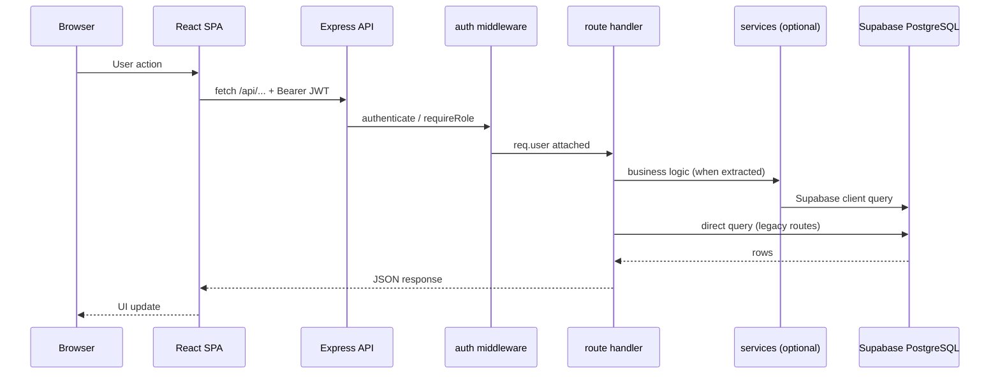

# ProPath — Architecture

High-level view of how ProPath is structured for development and client handoff.  
For ongoing refactor status, see [IMPROVEMENTS_TRACKER.md](./IMPROVEMENTS_TRACKER.md) (Section 10).

---

## System overview

ProPath is a **multi-tenant exam platform**. Organizations manage tests, students, and staff; students take exams; platform SuperAdmins manage the whole system.

```
┌─────────────────┐     HTTPS / JSON      ┌─────────────────┐     service role     ┌─────────────────┐
│  React SPA      │  ──────────────────►  │  Express API    │  ─────────────────►  │  Supabase       │
│  frontend/      │  Authorization:       │  backend/       │  (PostgreSQL)        │  (managed DB)   │
│  port 3000      │  Bearer <JWT>         │  port 3001      │                      │                 │
└─────────────────┘                       └─────────────────┘                      └─────────────────┘
```

**Security rule:** the browser never talks to Supabase directly. All data flows through the Express API, which uses the Supabase **service role** key server-side.

---

## Request flow




---

## Repository layout

```
propath/
  frontend/          React SPA (Create React App)
  backend/           Express API (ES modules)
  docs/              Client handoff + tracker
  Reference_Documents/   Database schema reference
  tech.md            Quick stack reference
```

### Backend layers


| Layer      | Path                         | Responsibility                                     |
| ---------- | ---------------------------- | -------------------------------------------------- |
| Entry      | `backend/server.js`          | Express app, CORS, JSON, health, error handling    |
| Registry   | `backend/routes/index.js`    | Mounts all `/api/*` prefixes                       |
| Routes     | `backend/routes/**`          | HTTP handlers, validation, auth guards             |
| Services   | `backend/services/**`        | Business logic (growing; see `services/README.md`) |
| Middleware | `backend/middleware/`        | JWT auth, role checks, request validation          |
| Config     | `backend/config/database.js` | Supabase client                                    |
| Utils      | `backend/utils/`             | JWT, passwords, logging, shared helpers            |
| Migrations | `backend/db/migrations/`     | Ordered SQL for Supabase                           |


### Frontend layers


| Layer      | Path                       | Responsibility                               |
| ---------- | -------------------------- | -------------------------------------------- |
| Shell      | `frontend/src/app/`        | `App.js`, `AppRoutes.jsx`, route guards      |
| Features   | `frontend/src/features/`   | Domain routes (auth, org, student, admin, …) |
| API client | `frontend/src/api/`        | Domain modules; barrel at `services/api.js`  |
| Pages      | `frontend/src/pages/`      | Legacy paths (re-exports during migration)   |
| Components | `frontend/src/components/` | Shared UI, layouts, NotificationBell, etc.   |


---

## Roles and portals


| Role               | Portal prefix (UI) | Primary API prefixes                                    |
| ------------------ | ------------------ | ------------------------------------------------------- |
| **SuperAdmin**     | `/admin/`*         | `/api/admin/*`                                          |
| **OrgAdmin**       | `/org/`*           | `/api/org/*`, `/api/profile`, `/api/notifications`      |
| **Reviewer**       | `/reviewer/`*      | `/api/reviewers/*`, `/api/questions/*`, `/api/org/auth` |
| **Subject Expert** | `/expert/`*        | `/api/questions/*`, `/api/org/auth`                     |
| **Student**        | `/student/`*       | `/api/student/*`, `/api/student/auth`                   |


JWT payload includes `userId`, `role`, and (for org users) `orgId`. Token is stored in `localStorage.authToken` and sent on every API call.

---

## Authentication

1. User logs in via role-specific auth endpoint (e.g. `POST /api/org/auth/login`).
2. API returns JWT; frontend stores it in `localStorage`.
3. Protected routes use `authenticate` middleware → `requireRole([...])` or `requireSuperAdmin`.
4. First-login password change: `MustChangePassword` flag on `OrgUsers` → welcome flow before full portal access.

See [API_OVERVIEW.md](./API_OVERVIEW.md) for endpoint prefixes.

---

## Data store

- **Database:** Supabase (PostgreSQL).
- **Schema reference:** `Reference_Documents/Database_Schema.md`.
- **Migrations:** run scripts in order from `backend/db/migrations/` (see [DEPLOYMENT.md](./DEPLOYMENT.md)).

The API uses `@supabase/supabase-js` with the **service role** key — Row Level Security is bypassed; authorization is enforced in Express middleware and route logic.

---

## Remaining refactor (optional)

Client handoff phases **A–G are complete**. Optional follow-ups:

- Migrate other portals (`pages/student/*`, `pages/admin/*`, etc.) into `features/*/pages/` where not already done

---

## Related docs


| Doc                                                  | Purpose                                        |
| ---------------------------------------------------- | ---------------------------------------------- |
| [API_OVERVIEW.md](./API_OVERVIEW.md)                 | API prefixes, auth, admin sub-routes           |
| [DEPLOYMENT.md](./DEPLOYMENT.md)                     | Local dev, env vars, SQL order, prod checklist |
| [QUERY_OPTIMIZATION.md](./QUERY_OPTIMIZATION.md)     | Bulk queries, list+modal data-loading pattern  |
| [IMPROVEMENTS_TRACKER.md](./IMPROVEMENTS_TRACKER.md) | Refactor status and phases                     |
| [../tech.md](../tech.md)                             | Stack summary                                  |
| [../backend/README.md](../backend/README.md)         | Backend setup and sample endpoints             |
| [../frontend/README.md](../frontend/README.md)       | Frontend setup                                 |


