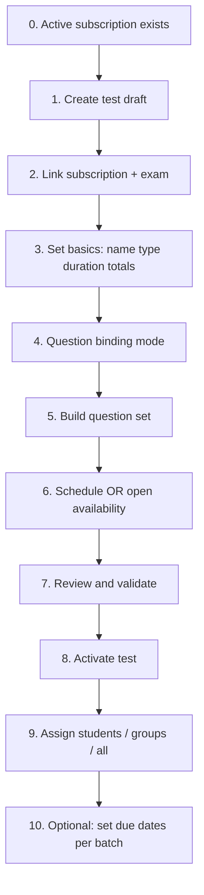

# OrgAdmin test lifecycle: schedule, open window, assignment & questions

This document describes a **clear product flow** for organization administrators: creating tests, attaching questions (custom / hybrid / auto), scheduling vs “open” availability, and assigning students. It is aligned with `Database_Schema.md`, notes **gaps in the current codebase**, and lists **recommended database changes** (including persisting binding mode).

For adaptive learning depth (mastery, cold start, separate tracks), see `Adaptive.md`.

### Code evolution strategy (no big-bang rewrite)

- **Do not delete** the existing Tests / TestQuestions / assignment modules. Ambiguity is removed by **incremental changes**: one source of truth in the DB, API reads/writes it, UI keeps calling the same endpoints.
- After you add columns (e.g. `QuestionBindingMode`, `HybridAutoPercent`, `ScheduleMode`), **replace** any in-memory or duplicate state in `backend/routes/tests.js` with **SELECT/UPDATE** on `Tests` — as implemented for binding config.
- **Existing rows** pick up defaults (`custom`, `0`, `open`) from `DEFAULT` constraints; no mandatory data migration for old tests beyond what the DB already applied.
- **New behaviour** (e.g. subscription-only create, wizard UI) can be layered **on top** without throwing away working routes.

---

## 1. Three different time concepts (do not mix them)

| Concept | Where it lives | Meaning |
|--------|----------------|---------|
| **Scheduled test window** | `Tests.StartTime`, `Tests.EndTime`, optional `Tests.TestDate` | When the *test content* is considered “open” for attempts. If `StartTime` / `EndTime` are set, students can only start (or finish, per your rules) inside that window. |
| **Open / unscheduled test** | `Tests.StartTime` and `Tests.EndTime` both **NULL** | No fixed server-side window on the test row; students may start any time **subject to assignment** and org policy. |
| **Assignment due** | `TestAssignments.DueDate` | Per-student (or per-assignment-row) deadline: “complete by this instant.” Independent of whether the test has a global window. |

**Recommended mental model for OrgAdmin UI**

1. **Test availability (global)** — “When can this test run?” → maps to `Tests` schedule fields (or “always on” if null).
2. **Who must take it** — `TestAssignments` rows (student / group / all / multiple).
3. **When each assignee must finish** — `TestAssignments.DueDate` (optional but recommended).

**Conflict rule (recommended):** A student should be allowed to start only if:

- Assignment exists and is `Pending` / `InProgress`, **and**
- `now` is within `Tests` window (if any window is defined), **and**
- `now` is before `TestAssignments.DueDate` (if due is set).

Document this in UI copy so admins do not set a due date that is *before* the test’s `StartTime`.

---

## 2. Recommended OrgAdmin flow (end-to-end)

This is the **target** experience; Section 5 compares it to what exists today.



### 2.1 Subscription prerequisite — no plan, no new test (product rule)

**Rule:** An OrgAdmin may **create a new test** only when the **organization has at least one qualifying subscription** (a purchased / active subscription plan that entitles test creation for that org). If there is **no** such subscription, **block** test creation (do not allow an empty or orphan test row).

**Why:** Tests are tied to commercial limits (`SubscriptionPlanExams`, `UsageCounters`, `MaxTests`, etc.). Allowing create without a subscription breaks billing, quotas, and exam linkage.

**Data model (see `Database_Schema.md`):**

| Concept | Typical tables / fields |
|--------|-------------------------|
| Org’s purchase | `Subscriptions` with `EntityType = 'Organization'`, `EntityID = Organizations.OrgID` |
| Plan definition | `SubscriptionPlans`, `SubscriptionPlanExams` (exam entitlements, caps) |
| Usage | `UsageCounters` (e.g. tests created per period) |

**What “active” means (define in code, document here):** e.g. `Subscriptions.Status` in a set like `Active` (or `Completed` only for historical reads — not for new creates). Align with how you treat renewal and grace periods.

**Implementation (done in codebase):**

| Layer | Behaviour |
|-------|-----------|
| **API** | `POST /api/org/tests`: `orgHasQualifyingSubscription(orgId)` — if no **Active** org subscription with `EndDate >= now`, **403** with `code: SUBSCRIPTION_REQUIRED` and message *“No active organization subscription…”*. |
| **UI** | `src/pages/org/Tests.jsx`: “Create Test” disabled without a qualifying subscription; banner + link to **`/org/subscription-plans`**. Create modal still shows its own empty state if opened via other paths. |
| **Edge cases** | Expired / non-Active subscriptions excluded; chosen `subscriptionId` on create still validated as today (belongs to org, plan includes exam). |

**Optional UI copy:** *“Test creation requires an active organization subscription. Please subscribe or renew, then return here.”*

### Step-by-step (what “proper” looks like)

0. **Subscription gate** — If step 0 fails, stop; user cannot reach “Create draft” (or API rejects). *See §2.1.*

1. **Create draft** — Insert `Tests` with `Status = 'Inactive'` (or equivalent) until validation passes. *Today the app often creates `Active` tests immediately; a draft state reduces half-configured tests in production.*

2. **Subscription + exam** — `Tests.SubscriptionID` and `Tests.ExamID` (already in schema / migrations) gate which exams and limits apply (`SubscriptionPlanExams`, `UsageCounters`).

3. **Basics** — `TestName`, `TestType` (`Practice` / `Mock` / `Final`), `DurationMinutes`, planned `TotalQuestions` / `TotalMarks` (kept in sync with `TestQuestions` as today).

4. **Question binding mode** (custom / auto / hybrid) — Should be **persistent** (see Section 4). Drives how the “add questions” UI behaves (`customOnly` flag on available-questions API today).

5. **Build question set** — Rows in `TestQuestions` (`Marks`, `NegativeMarks`, `DisplayOrder`, optional `TimeLimit`). Respect plan caps (`MaxQuestionsPerTest`) and subject `Weightage` (already enforced in `tests.js`).

6. **Schedule vs open**
   - **Scheduled:** set `TestDate` + `StartTime` (+ derived or explicit `EndTime`).
   - **Open:** leave `StartTime` / `EndTime` null; rely on assignment + due date.

7. **Review** — Show summary: question count vs `TotalQuestions`, schedule vs due, binding mode, assignee count (0 before assign).

8. **Activate** — `Tests.Status = 'Active'` only after minimum questions and policy checks.

9. **Assign** — Create `TestAssignments` (`AssignmentType`, `StudentID`, optional `GroupID`, `DueDate`, `AssignedBy`).

10. **Communicate** — Optional future: `TestAssignments` notes or notification (not in base schema).

---

## 3. Current schema (relevant objects)

From `Database_Schema.md` (plus noted migrations):

| Table | Role |
|-------|------|
| `Tests` | Master test: org, exam, name, type, duration, totals, **TestDate / StartTime / EndTime**, status. **SubscriptionID** added via migration. |
| `TestQuestions` | Fixed links: which questions belong to this test, marks, order. |
| `Questions` / `Topics` / `Subjects` / `Chapters` | Content hierarchy; org-scoped questions use `OrgID` / `CreatedByOrgUserID`. |
| `TestAssignments` | Who may attempt which test; **DueDate**; status workflow. |
| `StudentAttempts` | Runtime attempts (timing, marks). *Production DB often adds `Status`, `TotalMarks`, etc.; keep schema doc in sync with live DB.* |

**Enums of note:** `test_type_enum`, `status_organizations_enum` on `Tests.Status`, `difficulty_level_enum`, `question_type_enum`.

---

## 4. Question binding: custom, auto, hybrid (persist in DB)

### Intended meaning (product)

| Mode | Behaviour (high level) |
|------|-------------------------|
| **Custom** | OrgAdmin explicitly picks each question; `TestQuestions` is the source of truth for delivery (current student attempt flow). |
| **Auto** | Selection rules pick questions at runtime or at “generate paper” time from pools (needs engine + persistence; not fully implemented as a separate runtime path in current student `TestAttempt`). |
| **Hybrid** | Mix: e.g. X% fixed from `TestQuestions`, rest from auto rules; `autoPercent` configures the split. |

### Schema columns (on `Tests`)

These should exist in PostgreSQL (run migrations if not already applied):

```sql
ALTER TABLE public."Tests"
  ADD COLUMN IF NOT EXISTS "QuestionBindingMode" text
    CHECK ("QuestionBindingMode" IN ('custom','auto','hybrid'))
    DEFAULT 'custom';

ALTER TABLE public."Tests"
  ADD COLUMN IF NOT EXISTS "HybridAutoPercent" numeric DEFAULT 0
    CHECK ("HybridAutoPercent" >= 0 AND "HybridAutoPercent" <= 100);
```

### Backend behaviour (post-migration)

- **`GET/PUT /api/org/tests/:testId/binding-config`** reads and writes **`QuestionBindingMode`** and **`HybridAutoPercent`** on `Tests` (no in-memory map).
- **`GET /api/org/tests/:testId`** includes **`bindingType`**, **`autoPercent`**, and **`scheduleMode`** in the JSON (derived from the row for API consistency).
- **`POST /api/org/tests`** sets **`QuestionBindingMode`** (optional body `questionBindingMode`, default `custom`), **`HybridAutoPercent`** (optional `hybridAutoPercent` when hybrid), and **`ScheduleMode`**: `scheduled` if `StartTime` is set, otherwise `open`.

`Adaptive.md` §2.2 still applies to **future** adaptive JSON / runtime auto-selection — the columns above cover **persistence** of org-chosen modes.

**Optional later (adaptive / rich rules):** versioned JSONB on `Tests` (e.g. `AdaptiveConfigJSON` + `AdaptiveConfigVersion`) per `Adaptive.md` guardrails — only after you have a schema validator.

---

## 5. Schedule & availability (`ScheduleMode` on `Tests`)

**Column** (if migrated):

```sql
ALTER TABLE public."Tests"
  ADD COLUMN IF NOT EXISTS "ScheduleMode" text
    CHECK ("ScheduleMode" IN ('open','scheduled'))
    DEFAULT 'open';
```

- **`open`** — no fixed start window on the test row (`StartTime` / `EndTime` typically null).
- **`scheduled`** — test is tied to a window; set when `StartTime` is provided on create (API sets `ScheduleMode` to `scheduled` in that case).

Keep **one source of truth**: on create, the API sets `ScheduleMode` from whether a start time was sent; future **edit-test** endpoints should update `ScheduleMode` whenever `StartTime` / `EndTime` change.

---

## 6. Assignment model: current vs improvements

**Current (`TestAssignments`):** `TestID`, `StudentID`, `GroupID`, `AssignmentType`, `DueDate`, `Status`, `AssignedBy`, `AssignedAt`. Unique `(TestID, StudentID)`.

**Possible extensions (if product needs them):**

- `Instructions` or `Notes` (text) — per-assignment message to student.
- `AvailableFrom` / `AvailableUntil` on assignment — if the same test must have **different** windows per cohort (today everything shares `Tests` window unless you only use due date).

Only add columns if you implement the corresponding student-side checks.

---

## 7. Current codebase snapshot (what exists & pain points)

| Area | Location / behaviour | Gap |
|------|----------------------|-----|
| Test create | `src/pages/org/Tests.jsx` (modal), `POST` in `backend/routes/tests.js` | Create, list, assign, and overview are **tightly coupled** in one large screen; easy to skip steps (e.g. assign before questions). |
| Questions | `src/pages/org/TestQuestions.jsx`, routes under `/api/org/tests/:testId/questions*` | Separate route from main Tests page; admin must discover “Test questions” entry. |
| Binding mode | `PUT /api/org/tests/:testId/binding-config` | **Persisted** on `Tests` (`QuestionBindingMode`, `HybridAutoPercent`). |
| Min questions | `checkMinQuestionsForActivateOrAssign` | Uses **`TestQuestions` row count** when the count query succeeds; falls back to `Tests.TotalQuestions`. |
| Activate / assign guards | Same helper before assign and status change | Good pattern; should include binding + schedule validation messages in UI. |
| Student start | `backend/routes/students.js` | Uses `Tests` window + assignment due; camelCase/PascalCase normalized in recent fixes. |

**Nothing “wrong” with having separate pages** if navigation is a **wizard** or sidebar steps: Create → Questions → Schedule → Assign → Review.

---

## 8. Suggested UI information architecture (OrgAdmin)

1. **Tests hub** — List + status filters; primary CTA **“New test”** only if **§2.1** subscription gate passes; otherwise CTA to subscribe / renew.
2. **Test editor (tabs or steps)**  
   - Overview (metadata, subscription, exam)  
   - Questions (binding mode + picker + order)  
   - Schedule (open vs window; preview in student timezone later)  
   - Assignments (who + due; replace assignments action)  
   - Activity / attempts summary (read-only, future)
3. **Global “Test assignments”** view — Cross-test assignee management (`TestAssignments.jsx` style) for bulk ops.

---

## 9. Checklist before assigning students

- [ ] **Organization has an active subscription** that allows creating/using this test (§2.1).
- [ ] `TestQuestions` count ≥ minimum (plan + org policy).
- [ ] `TotalQuestions` / `TotalMarks` consistent with linked questions (or auto job).
- [ ] Binding mode saved **in database** (after migration).
- [ ] Schedule: either explicit window or consciously “open”.
- [ ] `DueDate` not before `StartTime` when both set.
- [ ] `Tests.Status = 'Active'` when students should see the test.

---

## 10. References

- `Reference_Documents/Database_Schema.md` — canonical `Tests` definition includes `QuestionBindingMode`, `HybridAutoPercent`, `ScheduleMode`; migration-style `ALTER`s kept for existing DBs.
- `backend/scripts/add_tests_binding_schedule.sql` — idempotent SQL for the three columns + checks (new environments).
- `Reference_Documents/Adaptive.md` — adaptive track, JSON versioning guidance.
- `backend/routes/tests.js` — org test CRUD, assignment endpoints, **DB-backed** binding config, subscription gate on create.
- `src/pages/org/Tests.jsx`, `TestQuestions.jsx`, `TestAssignments.jsx` — UI entry points.

---

## 11. Summary (Urdu / Roman Urdu)

- **Subscription zaroori:** naya test tabhi jab org ke paas **active subscription** ho — **API + Tests page UI** dono enforce (§2.1).
- **Teen alag cheezein:** test ka **window** (`Tests` start/end), **assignment due** (`TestAssignments.DueDate`), aur **open test** (window null). In ko UI par alag labels se samjhain.
- **Sahi flow:** pehle **subscription gate**, phir test + exam/subscription, phir **binding mode** **`Tests.QuestionBindingMode` / `HybridAutoPercent`**, phir questions, phir schedule (`ScheduleMode` + times), phir activate, phir assign.
- **Binding ab DB mein** — restart par lost nahi; schema `Database_Schema.md` + script `backend/scripts/add_tests_binding_schedule.sql`.
- **UI behtar (future):** wizard / tabs — abhi incremental updates se kaam chal raha hai.
