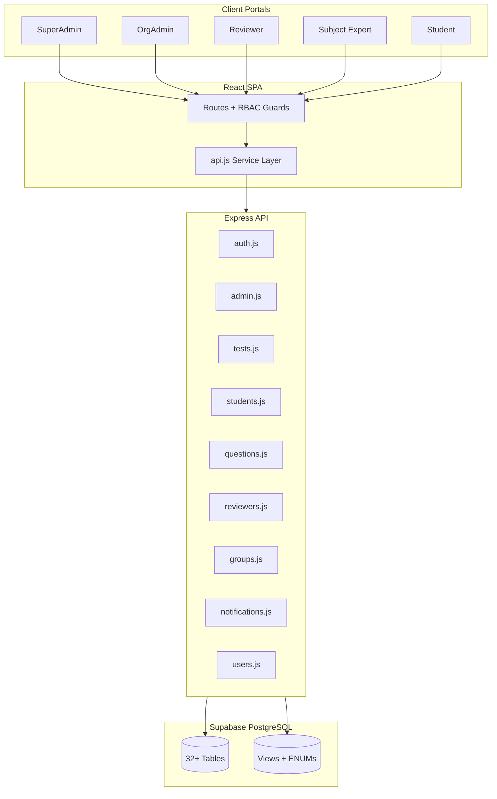

# ProPath — Builder Portfolio & ImagineArt Application Brief

> **Purpose:** Copy-paste ready document for LinkedIn DMs, hiring posts, and portfolio sharing.  
> **Target:** [ImagineArt hiring post](https://www.linkedin.com/) — *“Don’t send your CV. Send proof that you build.”*  
> **Author:** [Your Name]  
> **Last updated:** May 2026

---

## Quick links (fill before sending)


| Resource                         | Link                                                                                                                  |
| -------------------------------- | --------------------------------------------------------------------------------------------------------------------- |
| **GitHub repository**            | `https://github.com/YOUR_USERNAME/propath` ← replace                                                                  |
| **Live demo / Loom walkthrough** | `https://loom.com/share/YOUR_VIDEO` ← replace                                                                         |
| **Google Doc (full detail)**     | **[ProPath — Full Technical & Product Doc](https://docs.google.com/document/d/REPLACE_WITH_YOUR_GOOGLE_DOC_ID/edit)** |
| **LinkedIn profile**             | `https://linkedin.com/in/YOUR_PROFILE` ← replace                                                                      |


> **Tip:** Upload this `.md` to Google Docs (*File → Import*), polish formatting, then paste the share link above.

---

## One-liner (for DM subject / first line)

**ProPath** is a **multi-tenant B2B exam & learning SaaS** I designed and built end-to-end — **5 role portals**, **32+ PostgreSQL tables** (schema designed to scale toward **100+**), subscription quotas, MCQ review pipelines, test composition (**Custom / Auto / Hybrid**), enrollment governance, and live student attempts with analytics — **React · Node.js · Express · Supabase (PostgreSQL) · JWT RBAC**.

---

## Why this post matters to me (ImagineArt)

ImagineArt is looking for someone who:

- **Experiments** when others consume  
- **Ships** when others plan  
- **Learns** faster than the hype cycle

That is exactly how **ProPath** was built: not a tutorial clone, not a Figma-only concept — a **working product** with real tenant isolation, audit logs, and business rules enforced in the API layer.

I am applying with **proof**, not a CV.

---

## Executive summary


| Dimension         | Detail                                                                                                                    |
| ----------------- | ------------------------------------------------------------------------------------------------------------------------- |
| **Product type**  | Multi-tenant examination & learning platform (orgs + individual students)                                                 |
| **Stack**         | React (SPA) · Node.js + Express · PostgreSQL via Supabase · JWT auth                                                      |
| **Roles**         | SuperAdmin · OrgAdmin · Reviewer · Subject Expert · Student                                                               |
| **Database**      | **32 tables** + **1 view** + **30+ ENUM types** (extensible toward **100+** objects as AI, billing, and analytics mature) |
| **Frontend**      | **50+ page modules**, **5 portal layouts**, shared design tokens, Recharts dashboards                                     |
| **Backend**       | **9 route modules**, **~149 HTTP endpoints**, **~17,000+ lines** of route logic                                           |
| **API client**    | **~100 service methods** in `api.js` (~1,850 lines)                                                                       |
| **Documentation** | Schema-first `.md` workflow (`Database_Schema.md`, `README.md`, `tech.md`)                                                |
| **Maturity**      | **MVP+ / beta** — core exam lifecycle is live; payments UI & AI layer are roadmap                                         |


---

## The problem ProPath solves

Schools, academies, and coaching centers need more than a Google Form quiz:

1. **Subscribe** to curated exam catalogs (e.g. board exams, entry tests)
2. **Author & verify** thousands of MCQs with LaTeX/math support
3. **Compose tests** with flexible question binding (fixed paper vs pool draw vs hybrid)
4. **Govern** which students may attempt which exams (enrollments, approvals, withdrawals)
5. **Assign** tests to individuals, groups, or entire cohorts
6. **Run attempts**, score automatically, show topic-level breakdowns
7. **Audit** everything for accountability (who did what, when)

ProPath implements this as **true multi-tenant SaaS** — one platform, many organizations, strict data boundaries.

---

## Scale at a glance (impressive numbers)

```
┌─────────────────────────────────────────────────────────────┐
│  ProPath — Built scale (current codebase)                   │
├─────────────────────────────────────────────────────────────┤
│  PostgreSQL tables (documented)     32                      │
│  PostgreSQL views                   1  (Leaderboard)          │
│  PostgreSQL ENUM / domain types     30+                     │
│  Planned DB growth                  100+ tables/views/indexes │
│  User roles / portals               5                       │
│  React page modules                 50+                     │
│  Layout shells                      5                       │
│  Backend route files                9                       │
│  HTTP API endpoints (approx.)       ~149                    │
│  Backend route LOC (approx.)        ~17,400                 │
│  Frontend API service methods       ~100                    │
│  Protected React routes             40+                     │
└─────────────────────────────────────────────────────────────┘
```

> **Why “100+ tables” is realistic, not hype:**  
> The schema already reserves enums for `AIQuestionGeneration`, `question_source_enum` includes `'AI'`, `UsageCounters` tracks `AIQuestionsGenerated`, and `SubscriptionPlanTestModes` gates **Adaptive** and **Self-Test Builder** features. Shipping AI pipelines, payment webhooks, analytics warehouses, proctoring, and per-attempt telemetry typically **triples** table count on mature ed-tech platforms. ProPath’s **md-first schema** is designed for that growth without rewriting core flows.

---

## Tech stack


| Layer                 | Technology                                                  |
| --------------------- | ----------------------------------------------------------- |
| **Frontend**          | React 18, React Router, Create React App                    |
| **UI**                | Custom CSS, Lucide icons, Framer Motion, Recharts           |
| **Math content**      | KaTeX / LaTeX editor & renderer for MCQs                    |
| **Backend**           | Node.js, Express (ES Modules)                               |
| **Database**          | PostgreSQL on Supabase                                      |
| **Auth**              | JWT bearer tokens, bcrypt passwords                         |
| **Validation**        | express-validator                                           |
| **Deployment target** | AWS static frontend + API service (documented in `tech.md`) |


---

## Architecture (high level)




### Core design principles

1. **Server-side RBAC** — UI guards are convenience; security lives in Express middleware + query scoping.
2. **Org tenant isolation** — Org-scoped data never leaks across `OrgID`.
3. **Subscription gates** — Plans link to exams via `SubscriptionPlanExams`; usage tracked in `UsageCounters`.
4. **Two-layer content system** — Platform experts/reviewers (`Users`) vs org experts/reviewers (`OrgUsers`).
5. **Schema-first development** — `Reference_Documents/Database_Schema.md` is the source of truth; migrations align with docs.
6. **Audit everything** — `Logs` table with `PreviousData` / `NewData` JSONB snapshots.

---

## Database — 32 tables (current)

### User & organization (8)


| Table                 | Purpose                                                       |
| --------------------- | ------------------------------------------------------------- |
| `Users`               | Platform staff: SuperAdmin, platform Reviewer/Expert, Support |
| `Organizations`       | Tenant root                                                   |
| `OrgUsers`            | OrgAdmin, org Reviewer, org Subject Expert                    |
| `Students`            | Org-linked or individual (self-registered) learners           |
| `StudentGroups`       | Cohort management                                             |
| `StudentGroupMembers` | Many-to-many group membership                                 |
| `Certificates`        | Completion / merit certificates tied to attempts              |
| `Feedback`            | Ratings on tests, questions, or platform                      |


### Subscriptions & platform ops (5)


| Table                       | Purpose                                                               |
| --------------------------- | --------------------------------------------------------------------- |
| `SubscriptionPlans`         | Pricing, duration, features JSON, **Audience** (Org / Student / Both) |
| `SubscriptionPlanExams`     | Per-exam quotas: max students, tests, questions, AI flag              |
| `SubscriptionPlanTestModes` | Scheduled / Adaptive / Self-Test Builder entitlements                 |
| `Subscriptions`             | Active org or student subscriptions                                   |
| `UsageCounters`             | Monthly usage: tests created, attempts, AI questions generated        |
| `SystemSettings`            | Maintenance mode, global config (JSONB key/value)                     |
| `Announcements`             | Role-targeted banners                                                 |


### Exam content hierarchy (6)


| Table           | Purpose                                             |
| --------------- | --------------------------------------------------- |
| `Exams`         | Top-level exam catalog (e.g. ECAT, MDCAT)           |
| `Subjects`      | Subjects under an exam + weightage                  |
| `Chapters`      | Optional chapter grouping                           |
| `Topics`        | Leaf nodes for question tagging                     |
| `Questions`     | MCQ bank (platform + org scoped)                    |
| `Options`       | Answer choices with stable `OptionID` UUIDs         |
| `QuestionMedia` | Images/diagrams on question, option, or explanation |


### Tests & delivery (6)


| Table                    | Purpose                                                  |
| ------------------------ | -------------------------------------------------------- |
| `Tests`                  | Org tests: binding mode, schedule, subscription link     |
| `TestQuestions`          | Fixed paper (Custom / Hybrid custom portion)             |
| `TestAssignments`        | Assign to student / group / all / multiple               |
| `StudentExamEnrollments` | Org exam participation workflow (Pending → Approved → …) |
| `StudentAttempts`        | Live & completed attempts                                |
| `StudentAnswers`         | Per-option selections (supports multiple-correct)        |
| `ResultDetails`          | Subject/topic score breakdown                            |


### Commerce & comms (3)


| Table           | Purpose                                 |
| --------------- | --------------------------------------- |
| `Payments`      | Stripe / JazzCash / PayPal-ready schema |
| `Notifications` | In-app notification inbox               |
| `Logs`          | Full audit trail                        |


### Analytics view (1)


| Object        | Purpose                           |
| ------------- | --------------------------------- |
| `Leaderboard` | SQL view — ranked scores per test |


### ENUM types (30+)

Examples: `role_users_enum`, `difficulty_level_enum`, `question_source_enum` (**Self / AI / PastExam**), `action_type_enum` (includes `**AIQuestionGeneration`**), `payment_method_enum`, `student_exam_enrollment_status_enum`, and more — strong typing for long-term scale.

---

## What is **implemented** (detailed)

### 1. SuperAdmin portal


| Feature                 | Status | Notes                                              |
| ----------------------- | ------ | -------------------------------------------------- |
| Platform dashboard      | ✅      | Orgs, users, tests, revenue from payments          |
| Organizations CRUD      | ✅      | Create org, update status                          |
| Platform users          | ✅      | Create/update/delete platform staff                |
| Exam catalog setup      | ✅      | Exams → Subjects → Topics (+ chapters in schema)   |
| Subscription plans      | ✅      | Link exams, quotas, audience type                  |
| Subscriptions list      | ✅      | View all active subscriptions                      |
| Platform question bank  | ✅      | Cross-org visibility where allowed                 |
| Audit logs              | ✅      | Filterable activity                                |
| Health check page       | ✅      | API / dependency status                            |
| Settings                | ✅      | **Maintenance mode** + **global announcements**    |
| Create notifications    | ✅      | Broadcast to roles                                 |
| Revenue & Payments page | ⚠️     | Menu exists; dedicated route not wired in `App.js` |


### 2. OrgAdmin portal


| Feature                   | Status | Notes                                                |
| ------------------------- | ------ | ---------------------------------------------------- |
| Dashboard                 | ✅      | Metrics, Recharts, activity feed, quick nav          |
| Explore Exams             | ✅      | Marketing catalog + subscription badges              |
| Users (org staff)         | ✅      | Reviewers & experts per org                          |
| Students                  | ✅      | CRUD, bulk register, filters                         |
| Student groups            | ✅      | Create, add/remove members                           |
| **Exam enrollments**      | ✅      | Bulk assign, approve/reject, withdraw, directory     |
| Subscription plans (view) | ✅      | See org plans                                        |
| Subscription purchase     | 🔜     | UI shows **“Coming Soon”**                           |
| Tests list                | ✅      | Filter, status, binding info                         |
| **Test wizard**           | ✅      | Multi-step create/edit                               |
| Question binding          | ✅      | **Custom / Auto / Hybrid** + schedule modes          |
| Test questions            | ✅      | Add, bulk add, copy, reorder, remove                 |
| Test assignments          | ✅      | Single, multiple, group, all + eligible students API |
| Question bank             | ✅      | Org-scoped MCQs                                      |
| Org logs                  | ✅      | Accountability                                       |
| Notifications             | ✅      | Create + shared inbox page                           |
| Org settings              | 🔜     | Placeholder page only                                |


### 3. Reviewer portal


| Feature           | Status | Notes                                 |
| ----------------- | ------ | ------------------------------------- |
| Dashboard         | ✅      | Queue stats, charts, compact activity |
| Pending questions | ✅      | Approve / reject with comments        |
| Approved history  | ✅      |                                       |
| Experts overview  | ✅      |                                       |
| Notifications     | ✅      |                                       |


### 4. Subject Expert portal


| Feature         | Status | Notes                             |
| --------------- | ------ | --------------------------------- |
| Dashboard       | ✅      | Submission stats, quality metrics |
| Create question | ✅      | **LaTeX/KaTeX** editor + preview  |
| My questions    | ✅      | Draft / pending / verified states |
| Performance     | ✅      | Usage & accuracy stats            |
| Notifications   | ✅      |                                   |


### 5. Student portal


| Feature                | Status | Notes                                       |
| ---------------------- | ------ | ------------------------------------------- |
| Dashboard              | ✅      | Assignments overview                        |
| My Exams (enrollments) | ✅      | Org student exam participation              |
| Assignments            | ✅      | Pending / in-progress / completed           |
| **Test attempt**       | ✅      | Timed flow, answer persistence              |
| **Test results**       | ✅      | Score, topic breakdown, certificate display |
| Reports                | ✅      | Performance history                         |
| Self-test builder      | ✅      | Individual practice path                    |
| Subscription plans     | 🔜     | Purchase: **“Coming Soon”**                 |
| Notifications          | ✅      | Dedicated `/student/notifications` route    |


### 6. Cross-cutting platform features


| Feature                                                                      | Status |
| ---------------------------------------------------------------------------- | ------ |
| JWT auth (org, student, admin)                                               | ✅      |
| Maintenance mode + role allowlist                                            | ✅      |
| Global announcement banner                                                   | ✅      |
| Notification bell + full notifications page                                  | ✅      |
| Portal UI density system (`portal-tokens.css`, `portal-content-compact.css`) | ✅      |
| `usePortalUi` hook — consistent scale across all 5 portals                   | ✅      |
| Org signup / login, student signup / login                                   | ✅      |
| Production build (`npm run build`)                                           | ✅      |


---

## Critical business flows (end-to-end)

### Flow A — Content pipeline

```
Subject Expert creates MCQ (LaTeX) 
    → submits for review 
    → Reviewer approves/rejects 
    → Question enters org/platform bank 
    → OrgAdmin adds to test (Custom mode) OR Auto draws at attempt time
```

### Flow B — Test lifecycle

```
OrgAdmin creates test (wizard) 
    → selects exam + subscription 
    → configures binding (Custom / Auto / Hybrid) 
    → adds questions OR relies on pool 
    → publishes 
    → assigns to students/groups 
    → Student attempts 
    → Auto-scoring + ResultDetails by topic
```

### Flow C — Exam enrollment governance

```
OrgAdmin enrolls student in exam (bulk or single)
    → Status: Pending / Approved / Rejected / Withdrawn / Suspended
    → Backend gates: assignment + attempt APIs check enrollment
    → Student sees "My Exams" only for approved enrollments
```

### Flow D — Subscription enforcement

```
Org purchases plan (admin-assigned today; self-serve checkout planned)
    → SubscriptionPlanExams defines per-exam limits
    → UsageCounters track consumption
    → Test creation blocked when quota exceeded
```

---

## Backend API surface


| Route file         | ~Endpoints | Responsibility                                        |
| ------------------ | ---------- | ----------------------------------------------------- |
| `admin.js`         | 48         | Orgs, exams, plans, platform users, settings, stats   |
| `students.js`      | 31         | Students, enrollments, assignments, attempts, results |
| `tests.js`         | 20         | Test CRUD, binding, questions on test, assignments    |
| `auth.js`          | 19         | Login, signup, tokens, password                       |
| `questions.js`     | 9          | Question bank operations                              |
| `notifications.js` | 7          | CRUD + read state                                     |
| `groups.js`        | 7          | Student groups                                        |
| `reviewers.js`     | 6          | Review queue actions                                  |
| `users.js`         | 2          | User utilities                                        |


**Notable engineering (not trivial CRUD):**

- `bindingFromTestRow()` — normalizes Custom/Auto/Hybrid config from PostgREST casing  
- Eligible-students API — only students enrolled + subscribed for exam  
- Auto mode — no `TestQuestions` rows required; pool draw at attempt  
- Hybrid mode — validates custom portion + auto percent  
- Enrollment guards on assign + attempt paths  
- Audit logging with before/after JSON

---

## Frontend routes (by portal)

### OrgAdmin (`/org/*`)

`dashboard` · `users` · `explore-exams` · `subscription-plans` · `tests` · `tests/wizard` · `tests/wizard/:testId` · `tests/:testId/questions` · `test-assignments` · `students` · `student-exam-enrollments` · `groups` · `question-bank` · `test-questions` · `logs` · `notifications` · `create-notification` · `settings`

### Reviewer (`/reviewer/*`)

`dashboard` · `questions` · `approved` · `experts` · `notifications`

### Subject Expert (`/expert/*`)

`dashboard` · `create` · `questions` · `performance` · `notifications`

### SuperAdmin (`/admin/*`)

`dashboard` · `organizations` · `create-organization` · `users` · `create-platform-user` · `exams` · `exams/setup/:examId` · `questions` · `subscription-plans` · `subscriptions` · `settings` · `health` · `logs` · `notifications` · `create-notification`

### Student (`/student/*`)

`dashboard` · `my-exams` · `assignments` · `self-test` · `reports` · `subscription-plans` · `notifications` · `test/:testId` · `test/:testId/results`

---

## Documentation discipline (.md-first)


| Document                                     | Role                                              |
| -------------------------------------------- | ------------------------------------------------- |
| `README.md`                                  | Product overview + quick start                    |
| `Reference_Documents/Database_Schema.md`     | **Source of truth** for 32 tables, enums, indexes |
| `Reference_Documents/Main_Implementation.md` | Feature ↔ schema alignment                        |
| `Reference_Documents/System.md`              | UI conventions                                    |
| `tech.md`                                    | AWS handoff, env vars, roles                      |
| `settings.md`                                | Maintenance & announcements spec                  |


This is how a **solo builder** keeps a complex system coherent without a large team.

---

## What is **not yet implemented** (honest gaps)


| Area                                 | Current state                                                         |
| ------------------------------------ | --------------------------------------------------------------------- |
| **AI question generation (RAG)**     | Schema + enums ready; no generation pipeline                          |
| **Adaptive tests**                   | `SubscriptionPlanTestModes.IsAdaptiveEnabled` exists; logic not built |
| **AI explanations on wrong answers** | Roadmap only                                                          |
| **Stripe / JazzCash checkout**       | `Payments` table + admin stats; frontend **Coming Soon**              |
| **Org settings page**                | Empty placeholder                                                     |
| **Admin Revenue page**               | Nav item without route                                                |
| **Full certificate PDF issuance**    | DB + result UI; no download workflow                                  |
| **Leaderboard UI**                   | SQL view exists; no student-facing page                               |
| **Feedback product**                 | Table exists; minimal UI                                              |
| **Automated test suite**             | Not present                                                           |
| `**Implementations_Docs/`**          | Referenced in README; folder empty in repo                            |


**Positioning:** ProPath is a **serious MVP+** — the hard multi-tenant exam engine works; monetization automation and AI are the **next layer**, not vaporware claims.

---

## Future implementation roadmap

> Designed so the database can grow from **32 → 100+** objects without breaking existing tenants.

### Phase 1 — Monetization & ops (0–3 months)


| Item                                 | Description                                                       |
| ------------------------------------ | ----------------------------------------------------------------- |
| **Payment gateway integration**      | Stripe + JazzCash webhooks → `Payments` + subscription activation |
| **Org self-serve checkout**          | Replace “Coming Soon” on org subscription page                    |
| **Individual student subscriptions** | Student-audience plans + purchase + dashboard entitlements        |
| **Admin revenue dashboard**          | Wire `/admin/revenue` route; MRR, churn, failed payments          |
| **Org settings**                     | Branding, timezone, notification prefs, default test policies     |
| **Certificate PDF generator**        | Template engine + `CertificateURL` storage (S3)                   |
| **Email notifications**              | SES/SendGrid for assignment reminders, results                    |


**New tables (est. +8–12):** `PaymentWebhooks`, `Invoices`, `RefundRequests`, `OrgSettings`, `EmailQueue`, `CertificateTemplates`, …

### Phase 2 — AI & learning (3–9 months)


| Item                                   | Description                                                     |
| -------------------------------------- | --------------------------------------------------------------- |
| **RAG question generation**            | Embed syllabus + past papers → generate MCQs into review queue  |
| **AI explanation cards**               | On wrong answer: 1 visual + 2 sentences tied to selected option |
| **Adaptive test engine**               | Next paper shaped by `ResultDetails` + topic mastery            |
| **Question quality scoring**           | Flag ambiguous items from attempt statistics                    |
| **UsageCounters.AIQuestionsGenerated** | Enforce plan quotas on AI features                              |


**New tables (est. +15–25):** `AIGenerationJobs`, `DocumentChunks`, `Embeddings`, `PromptTemplates`, `StudentMastery`, `AdaptiveRules`, `AIExplanations`, …

### Phase 3 — Growth & engagement (6–12 months)


| Item                               | Description                                         |
| ---------------------------------- | --------------------------------------------------- |
| **Leaderboard UI**                 | Class / org / global ranks from existing view       |
| **Student feedback loops**         | Wire `Feedback` table to post-attempt prompts       |
| **Referral & org onboarding**      | Invite links, trial plans                           |
| **Explore Exams v2**               | Compare plans, sample questions, social proof       |
| **Mobile-responsive attempt mode** | PWA or React Native shell                           |
| **Proctoring (optional)**          | Tab focus, webcam snapshots — new compliance tables |


**New tables (est. +10–20):** `Referrals`, `Trials`, `ProctoringSessions`, `StudentStreaks`, `Badges`, …

### Phase 4 — Enterprise & analytics (9–18 months)


| Item                            | Description                  |
| ------------------------------- | ---------------------------- |
| **Multi-branch orgs**           | Sub-orgs under parent tenant |
| **SSO / SAML**                  | Enterprise login             |
| **Data warehouse export**       | BigQuery / Redshift sync     |
| **Custom report builder**       | OrgAdmin-defined exports     |
| **API for third-party LMS**     | Public REST + API keys       |
| **Row-level security policies** | Supabase RLS hardening       |


**New tables (est. +20–40):** `OrgBranches`, `SSOProviders`, `APIKeys`, `ReportDefinitions`, `ETLJobs`, `DataSnapshots`, …

### Projected database growth

```
Today:     32 tables  +  1 view  +  30+ enums
Phase 1:   ~44 tables
Phase 2:   ~65 tables
Phase 3:   ~85 tables
Phase 4:   100+ tables / views / materialized views
```

---

## Idea I would ship at ImagineArt (if I joined tomorrow)

**“Mistake → Micro-lesson” in 3 seconds**

Every wrong answer in a creative or learning flow should trigger:

1. **What you picked** vs **what was correct** (visual diff)
2. **Why** in two sentences — not a textbook paragraph
3. **One follow-up prompt** the user can try immediately (generative, on-brand)

I have already built the **data foundation** on ProPath: attempt telemetry, topic/chapter graph, reviewer-verified content, and enums for `AI` sourcing. The gap is connecting **generation + UX** so learning feels instant — the same product instinct ImagineArt needs at the intersection of **AI and creativity**.

---

## Tool / experiment I am playing with lately

- **Cursor + schema-first backend** — ship features like enrollment gates across 3 route files + 2 UI surfaces in one session without breaking tenant rules  
- **Density-token design systems** — replaced browser `zoom: 0.9` hack with `portal-tokens.css` + `portal-content-compact.css` for accessible, consistent UI scale  
- **Recharts + skeleton loading** — dashboards that feel like SaaS, not admin panels

---

## Ready-to-send LinkedIn DMs

### Option 1 — Something I built (recommended)

```
Hey — saw the ImagineArt builder post.

I’m not sending a CV on purpose.

I built ProPath — a multi-tenant exam SaaS (React, Node, PostgreSQL):
• 5 role portals (admin → org → expert/reviewer → student)
• 32+ tables, subscription quotas, MCQ review pipeline
• Test modes: Custom / Auto / Hybrid question binding
• Exam enrollment governance + live student attempts

It’s real software — tenant isolation and audit logs are enforced in the API, not just the UI.

GitHub / demo: [YOUR LINK]
Full detail: [YOUR GOOGLE DOC LINK]

Happy to walk through one flow live if useful.
```

### Option 2 — Idea I’d ship tomorrow

```
If I joined ImagineArt tomorrow, I’d ship a 1-week prototype:

“Wrong answer → 3-second micro-lesson”
(visual diff + 2-sentence why + 1 try-again prompt)

I’ve been building the data side on ProPath (attempt analytics, topic graph, verified question bank). The product gap is instant generative UX — which is exactly your world.

Repo: [YOUR LINK]
```

### Option 3 — Ultra short

```
Built ProPath — multi-tenant exam SaaS, 32+ PG tables, 5 roles, full MCQ→review→test→attempt flow. React/Node/Supabase. I ship when others plan.

[repo] · [Google Doc]
```

---

## How I think (builder mindset)


| Trait                               | Proof in ProPath                                                        |
| ----------------------------------- | ----------------------------------------------------------------------- |
| **Ship first**                      | End-to-end flows work before polish                                     |
| **Learn in public (on my machine)** | Document schema before code; iterate from feedback                      |
| **Experiment**                      | Custom/Auto/Hybrid binding, enrollment model, portal density system     |
| **Can’t stop learning**             | Roadmap toward RAG, adaptive tests, payments — honest about what’s next |
| **Product thinking**                | “Explore Exams” as marketing surface; maintenance mode for ops          |


---

## For HR / Recruitment / Growth / Creative angles


| Department           | What ProPath demonstrates                                               |
| -------------------- | ----------------------------------------------------------------------- |
| **Product**          | Full lifecycle ownership, quota logic, governance workflows             |
| **Engineering**      | 17k+ LOC API, typed schema, RBAC, non-trivial assignment rules          |
| **Growth**           | Explore Exams catalog, subscription badges, plan comparison UX          |
| **Creative**         | LaTeX MCQ authoring, dashboard visual language, announcement banners    |
| **HR / Recruitment** | This document + DM = *proof you build*, exactly what your post asks for |


---

## Appendix — File map for reviewers

```
propath/
├── backend/routes/          # 9 modules, ~149 endpoints
├── src/pages/               # 50+ screens by role
├── src/components/layouts/  # 5 portal shells
├── src/services/api.js      # ~100 API methods
├── src/styles/              # portal-tokens, portal-content-compact
├── Reference_Documents/     # Database_Schema.md (32 tables)
├── docs/                    # This file
└── README.md
```

---

## Checklist before you DM ImagineArt

- Replace GitHub link  
- Record 2–3 min Loom (Expert → Reviewer → Assign → Attempt)  
- Upload this doc to Google Docs → paste share link in table above  
- Pick one DM template and personalize first line  
- Send DM — **no CV attachment**

---

*Built with curiosity. Documented with discipline. Ready to learn faster on a team building something new.*